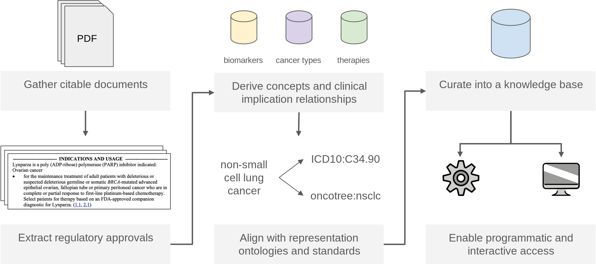

**Fig. 1: A standard operating procedure for making region-specific precision oncology approvals programmatically accessible**. Once relevant documents from an agency are identified, approvals of interest from each can be extracted. For example, precision oncology knowledge bases usually select cancer drugs with market authorization that have at least one approved indication involving a biomarker. For each approval, derive genomic knowledge statements by associating the biomarker, cancer type, and therapies involved and align each of these with representation ontologies and standards. These statements can then be compiled into a knowledge base, and made programmatically and interactively accessible.
