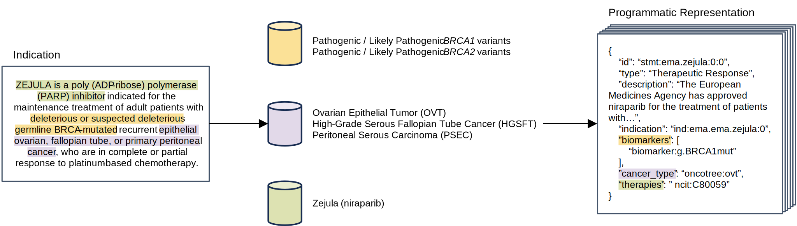

**Fig. 2: A single regulatory approval can derive to multiple precision oncology knowledge statements**. An approved indication of Zejula (niraparib) involves two biomarkers (pathogenic or likely pathogenic germline BRCA1/2 variants), three cancer types (ovarian, fallopian tube, and peritoneal cancers), and one therapy (niraparib itself). This results in six sets of biomarkers, cancer types, and therapies, each of which are derived to their own genomic knowledge statement.
